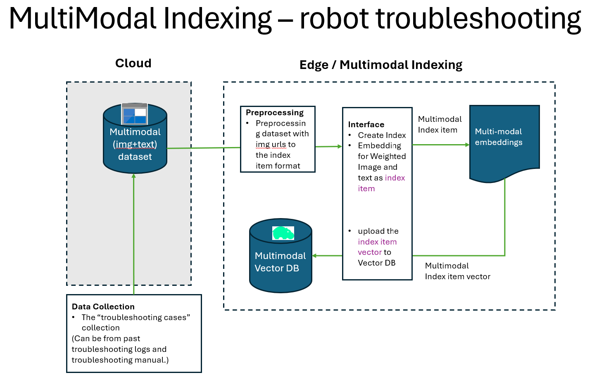
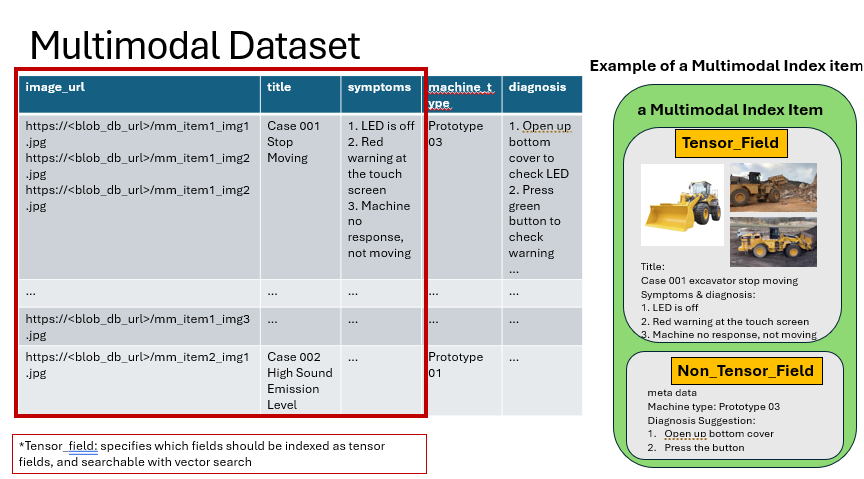
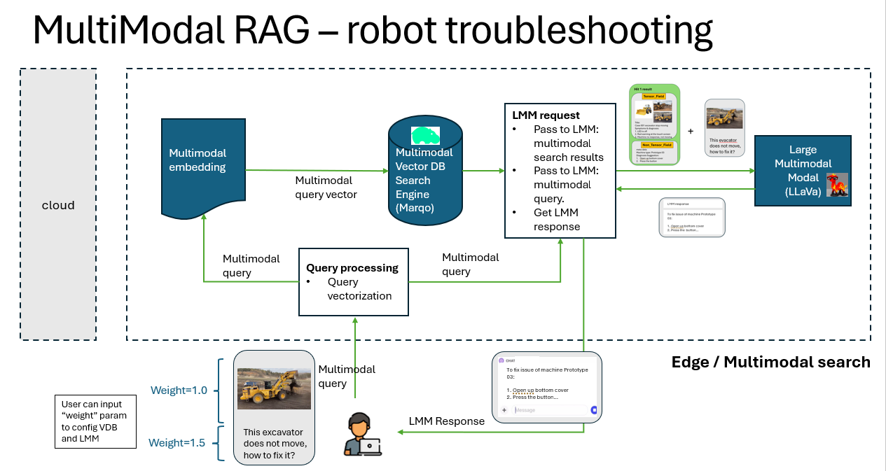

# Edge Multi-Model RAG Tool for Machine Troubleshooting

Multimodal RAG on Edge is a tool to perform multi-modal searches, which allows image, text, or combination of both as the input query, within files using a multi-modal vector search engine [Marqo](https://www.marqo.ai/#:~:text=Marqo%20helps%20you%20configure%20deep,images%20into%20a%20single%20vector.), and to generate a readable response based on the search result with [LLAVA (Microsoft' partnership Large Multimodal Model)](https://www.microsoft.com/en-us/research/project/llava-large-language-and-vision-assistant/).

The tool can help on machine troubleshooting on-site and more use cases. In this sample, we demonstrate how to use the tool as **industry copilot** to help people on construction site quickly troubleshoot the excavators. During the construction operation, When the excavators is broken, it is usually time-consuming for the staff on site to find the solution from the technical manual and the past troubleshooting logs or contact technical specialist for help. The edge multi-modal RAG tool serves as the industry copilot helping the operator staff to quickly fix the problems.

The solution is independent from cloud services, and the vector search engine and LMM can be deployed to the edge device with either CPU or GPU.

This solution supports multi-modal query for images and texts. Find the text-based version of Edge RAG solution here: [azure-edge-extensions-retrieval-augmented-generation](https://github.com/Azure-Samples/azure-edge-extensions-retrieval-augmented-generation?tab=readme-ov-file).

## Architecture

Multimodal RAG solution typically comprised with 2 processes: Indexing and Searching/Generation.

- Indexing is the process of creating a vector representation of the data.



The dataset format we are using is a csv file with image and text contents. The image and text contents will be embedding into the multi-modal vector database. The vector database is a multi-modal vector search engine, which is used to store and search the multi-modal vectors. The multi-modal vector search engine is used to perform the multi-modal vector search based on the multi modal input query of image and text.
The multimodal dataset structure and a typical multimodal index item are shown below:



- Searching/Generation is the process of finding the most similar vectors to a given query vector, and then generate the response based on the query and search result.



The Edge Mulitmodal RAG tool is composed of 4 components accessible via Web UI application:

- create_index: to create a new index in the multi-modal vector database.
- delete_index: to delete an existing index from the multi-modal vector database.
- upload_data: to upload a document which contains image and text contents to the multi-modal vector database. The document contents will be embedding into the vector database.
- search_and_generate: to perform a multi-modal vector search based on the multi modal input query of image and text, and the response will be generated based on the search result.
currently we use [Marqo](https://www.marqo.ai/) as the multi-modal vector search engine, and [LLAVA](https://www.microsoft.com/en-us/research/project/llava-large-language-and-vision-assistant/) as the Large Multimodal Model(LMM) to generate the response based on the search result.

## Getting Started

### Prerequisites

- An Azure subscription. If you don't have an Azure subscription, create a [free account](https://azure.microsoft.com/en-us/free/?WT.mc_id=A261C142F) before you begin.
- A Linux machine. The sample is tested on WSL2 Ubuntu 20.04 LTS.

### Installation

- Install docker engine on linux machine with the guide [here](https://docs.docker.com/engine/install/ubuntu/)
- Install packages

```bash
conda create -n llava python=3.10 -y
conda activate llava
pip install --upgrade pip 
pip install -r requirements.txt
```

### Quick Start

1. Download the repo to your local dev machine

    ```bash
    git clone <repo url>
    cd Multimodel-RAG-for-Machine-Troubleshooting
    ```

2. Use docker to run Marqo server on your local dev machine

    ```bash
    docker rm -f marqo
    docker pull marqoai/marqo:latest
    docker run --name marqo -it -p 8882:8882 marqoai/marqo:latest
    ```

3. Download github repo [LLAVA](https://github.com/ggerganov/llama.cpp/tree/master/examples/llava) and follow the instructions to compile LLAVA executable llava-cli to the local path ./llava

    ```bash
    git clone https://github.com/ggerganov/llama.cpp
    cd llama.cpp/examples/llava
    make llava-cli
    ```

4. Download llava model from [here](https://huggingface.co/mys/ggml_llava-v1.5-7b/tree/main) into your local path ./llava/models.
    You need to download the two model files:
    - mmproj-model-f16.gguf
    - ggml-model-q4_k.gguf

5. Run the following command

    ```bash
    streamlit run page_edge_multimodal_rag.py
    ```

    The browser will auto open the web UI page. If not, please open the browser and input the url http://localhost:8501.

6. Create an Azure Blob Storage account and upload your multimodal documents to the blob storage. Follow the instructions [here](https://docs.microsoft.com/en-us/azure/storage/blobs/storage-quickstart-blobs-python#upload-blobs-to-a-container).
    
    For demo purpose, use ./data/demo_dataset.csv as the document to upload. The dataset contains machine troubleshooting guidance and image urls.

    Remember to update the blob storage url in the file ./page_upload_data.py.

    ```python
    account_url = ""
    sas_token = ""  # Replace with the SAS token from your URL
    container_name = ""
    blob_name = ""
    local_file_path = "" # your local file path for the downloaded multimodal file

7. Use the web UI to perform the following operations:
    - page-create-index: Input a new index name and create a new index in the multi-modal vector database.
    - page-delete-index: Select an index name and delete it from the multi-modal vector database.
    - page-upload-data: The demo code will automatically download the dataset from Azure Blob Storage. The dataset contains image and text contents to be embedding into the multi-modal vector database.
    - page-search-and-generate: Input your query of text and image url, and input weights for both. Click search. The web app will send the query to the backend and get the response back.

    The response time depends on the edge machine's specs and computing power. For 8core/32GB RAM CPU, It takes seconds for vector search and a few minutes for LLAVA. Choose larger machine size to speed up the response time.

## Demo
The orignal demo video can be found [here](https://microsoftapc-my.sharepoint.com/:v:/g/personal/chencheng_microsoft_com/EXSpjNEssFFAmBqh2KCZk4kB8l-S6MKPl3SxGPMnwHmtUg?e=2prLvv&nav=eyJyZWZlcnJhbEluZm8iOnsicmVmZXJyYWxBcHAiOiJTdHJlYW1XZWJBcHAiLCJyZWZlcnJhbFZpZXciOiJTaGFyZURpYWxvZy1MaW5rIiwicmVmZXJyYWxBcHBQbGF0Zm9ybSI6IldlYiIsInJlZmVycmFsTW9kZSI6InZpZXcifX0%3D).

https://github.com/ChenCheng368/Edge-Multimodel-RAG-for-Machine-Troubleshooting/assets/45490176/94ac6c57-0ce0-4fe0-aa14-8bced1715165

## Resources
- [Github Repo: azure-edge-extensions-retrieval-augmented-generation](https://github.com/Azure-Samples/azure-edge-extensions-retrieval-augmented-generation?tab=readme-ov-file)
- [Multimodality and Large Multimodal Models (LMMs)](https://huyenchip.com/2023/10/10/multimodal.html)
- [What Is Multimodal Retrieval-Augmented Generation (RAG)](https://weaviate.io/blog/multimodal-rag#:~:text=Multimodal%20Retrieval%20Augmented%20Generation(MM%2DRAG)%E2%80%8B&text=By%20externalizing%20the%20knowledge%20of,to%20facts%20and%20reducing%20hallucination)
- [Marqo | Multimodal Vector Search](https://www.marqo.ai/#:~:text=Marqo%20helps%20you%20configure%20deep,images%20into%20a%20single%20vector.)
- [LLAVA: Large Language and Vision Assistant](https://www.microsoft.com/en-us/research/project/llava-large-language-and-vision-assistant/)
